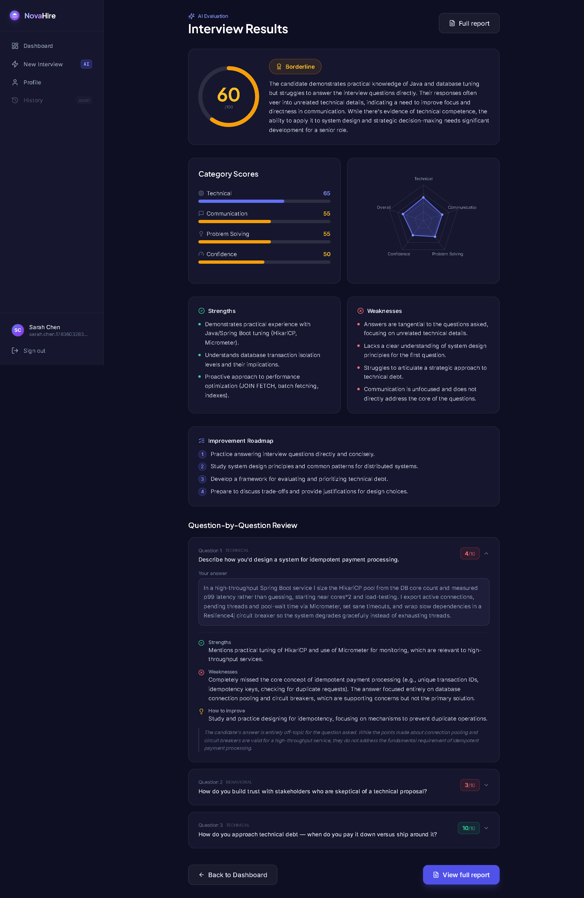
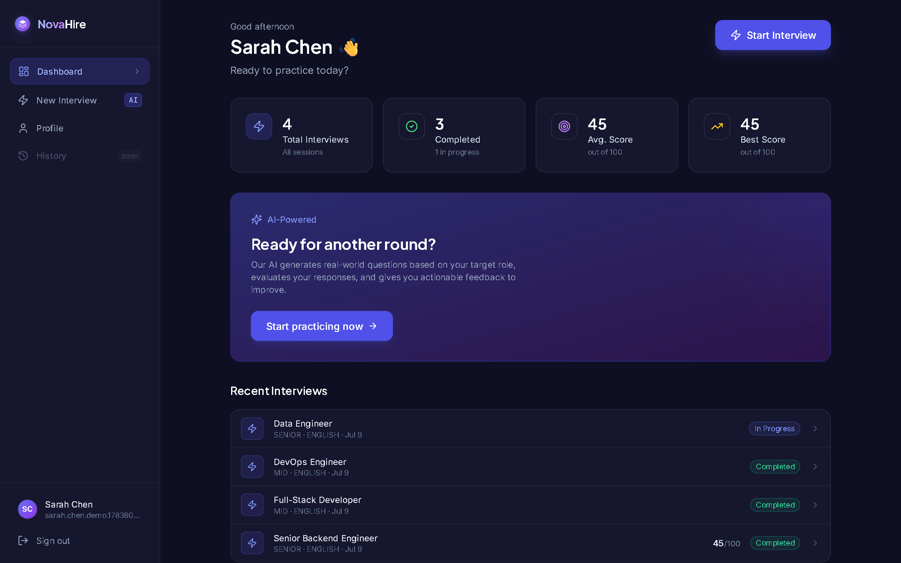
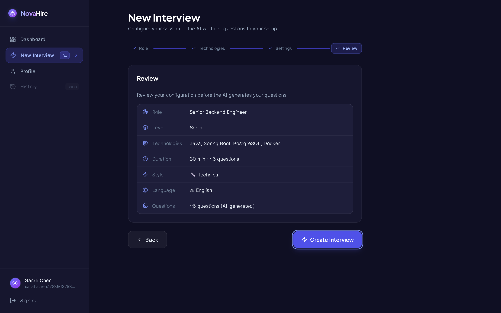
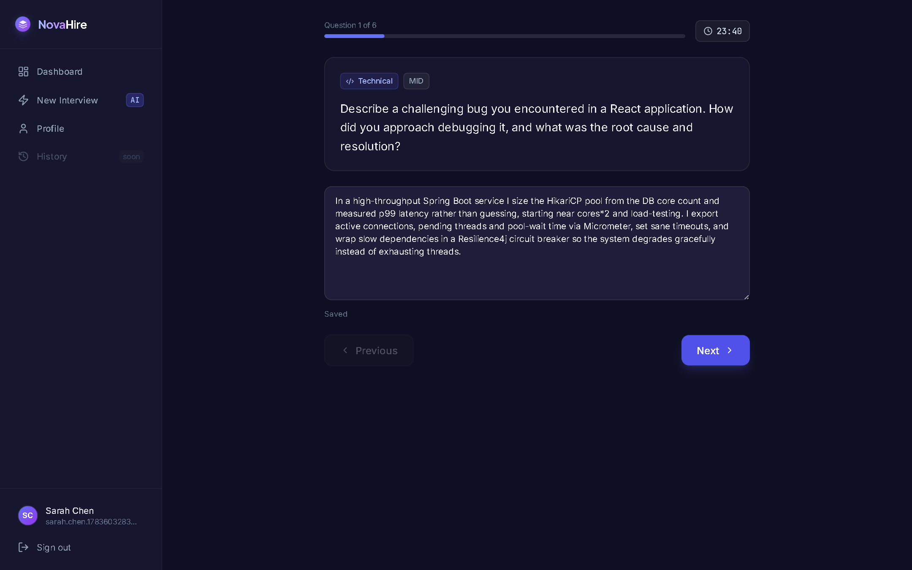
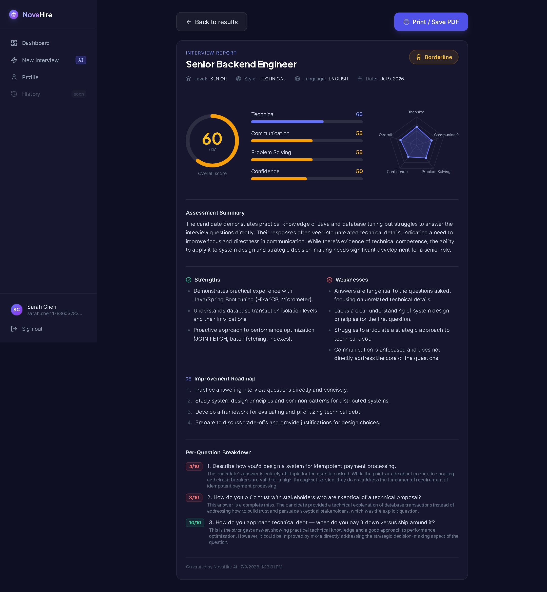
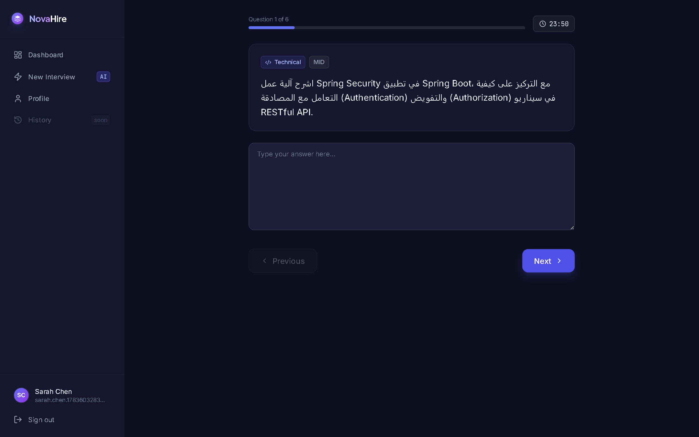
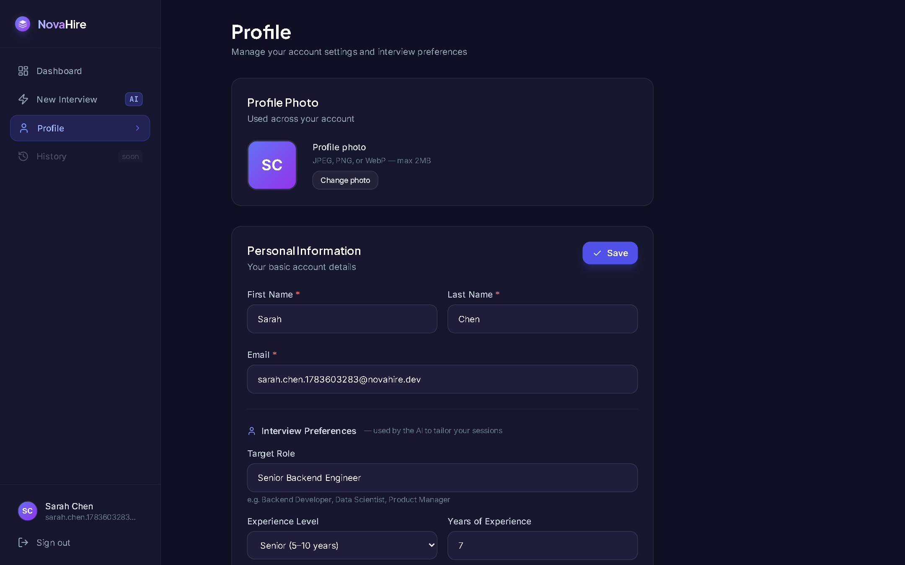
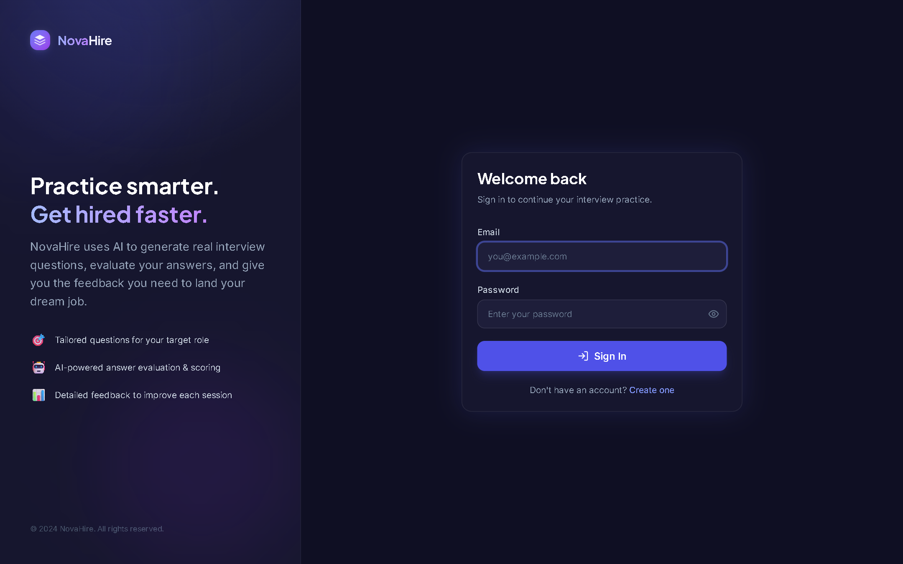
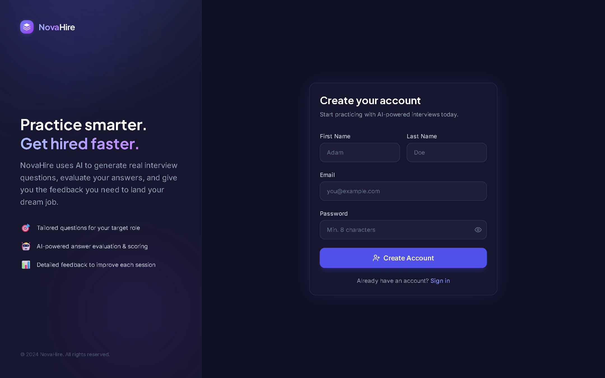

# NovaHire

AI-powered interview preparation platform built with Spring Boot, React, PostgreSQL, and Google Gemini.

NovaHire is an AI-powered interview preparation platform that helps software
engineers practice realistic technical interviews and receive structured
feedback on their performance.

---

## Project Overview

NovaHire reproduces the full loop of a technical interview so candidates can
prepare under realistic conditions. A user configures a session by choosing a
target role, experience level, technologies, language, and interview style. The
application generates a matching set of questions and presents them one at a
time, with a countdown timer and automatic saving of answers.

Once the session is finished, each answer is evaluated independently against the
expected response. NovaHire returns a per-question score together with
strengths, weaknesses, and concrete suggestions.

This is followed by an overall report that includes category scores, a hiring
recommendation, and an improvement roadmap. A summary of past sessions is
available on the user's dashboard.

The backend is built with Spring Boot and PostgreSQL and secured with JWT
authentication; the frontend is a React single-page application built with Vite
and Tailwind CSS. Question generation and evaluation run through a provider
abstraction, currently using Google Gemini as its AI provider, with support for
English, French, and Arabic. If the AI provider is unavailable, NovaHire
automatically falls back to a built-in question bank, ensuring interviews remain
available.

## Key Features

### Interview Configuration
- Guided multi-step configuration covering target role, experience level, technologies, duration, and interview style.
- Four interview styles (Mixed, Technical, Behavioral, System Design) that control the category mix of generated questions.
- Question count and difficulty are derived automatically from the chosen duration and experience level.

### Interview Session
- AI-generated questions are created specifically for each interview based on the selected configuration.
- Timed sessions with a live countdown and a per-question progress indicator.
- Answers are auto-saved while typing and restored when a session is reopened.
- Session start is concurrency-safe, so reloading a session never generates a duplicate set of questions.

### AI Evaluation
- Each answer receives an individual score together with detailed feedback, identified strengths, weaknesses, and improvement suggestions.
- An overall assessment reports five category scores (overall, technical, communication, problem-solving, confidence) and a hiring recommendation of Strong Hire, Hire, Borderline, or No Hire.
- Evaluation is idempotent and retries on failure; a failed run is recoverable and never alters saved answers.

### Reports and Dashboard
- Print-ready report page summarizing scores, recommendation, strengths, weaknesses, and an improvement roadmap.
- Dashboard with aggregate statistics (total, completed, average score, best score) and a list of recent sessions.

### Internationalization
- Full multilingual interview experience in English, French, and Arabic, including right-to-left support for Arabic.

### Accounts and Security
- Secure authentication using JSON Web Tokens (JWT).
- User profile management with interview preferences and avatar support.

The following screenshots illustrate the main workflow of the application.

## Screenshots

### Dashboard

Overview of interview statistics and recent sessions.

### Create Interview

Multi-step configuration of role, technologies, and interview style before question generation.

### Interview Session

Timed session with an AI-generated question, a live countdown, and auto-saved answers.

### Interview Report

Print-ready report with category scores, strengths, weaknesses, and an improvement roadmap.

Additional Screenshots

### Arabic Interview

An interview session rendered right-to-left in Arabic.

### Profile

User profile with interview preferences and avatar support.

### Login

Account sign-in screen.

### Register

Account creation screen.

