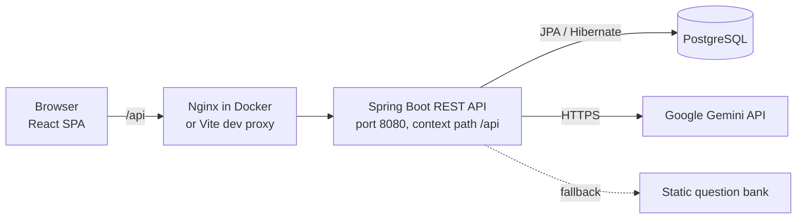

# NovaHire

**AI-powered interview preparation platform** built with Spring Boot, React, PostgreSQL, and Google Gemini.

NovaHire lets software engineers practice realistic technical interviews: configure a session, answer generated questions under a timer, and receive a structured AI evaluation with per-question feedback, category scores, a hiring recommendation, and an improvement roadmap.


---

## ✨ Features

**Interview configuration**
- Multi-step wizard: target role, experience level (Junior / Mid / Senior / Lead), technologies, duration, language, and interview style.
- Four interview styles — Mixed, Technical, Behavioral, System Design — each driving a different question category mix.
- Question count is derived from duration (1 question per 5 minutes, clamped to 3–15).

**Interview session**
- Questions are generated by Google Gemini for the chosen role, level, and technologies.
- Live countdown anchored to a server-side start time, plus a per-question progress bar.
- Debounced auto-save of answers (flushed on navigation), restored when a session is reopened.
- Session start uses a pessimistic row lock, so reloading never generates a second question set.

**AI evaluation**
- Each answer gets a 0–10 score with strengths, weaknesses, suggestions, and an explanation.
- Overall report with five 0–100 scores (overall, technical, communication, problem-solving, confidence) and a recommendation: Strong Hire, Hire, Borderline, or No Hire.
- Evaluation is idempotent, retried once automatically, and can be retried manually after a failure without touching saved answers.

**Reports and dashboard**
- Printable report page (browser print) with scores, recommendation, strengths, weaknesses, and roadmap.
- Dashboard with total, completed, and in-progress interviews, average and best score, and the five most recent sessions.

**Accounts**
- Registration and login with JWT.
- Profile management: personal details, interview preferences, avatar upload, password change.

---

## 🛠️ Tech Stack

| Layer | Technologies |
|---|---|
| **Backend** | Java 17, Spring Boot 3.2.5 (Web, Data JPA, Security, Validation), JJWT 0.11.5, Lombok, Maven |
| **Frontend** | React 18, Vite 5, React Router 6, Tailwind CSS 3, Axios, react-hot-toast, lucide-react |
| **Database** | PostgreSQL 16, Hibernate (schema managed with `ddl-auto: update`) |
| **AI** | Google Gemini REST API (`generateContent`), default model `gemini-2.5-flash-lite` |
| **DevOps / Tools** | Docker, Docker Compose, Nginx (serves the frontend build and proxies `/api`) |

---

## 🏗️ Architecture

NovaHire is a classic three-tier application: a React single-page app, a stateless Spring Boot REST API, and a PostgreSQL database. The backend calls the Gemini API over HTTPS.



The backend follows a layered structure:

- **Controllers** — `AuthController`, `UserController`, `InterviewController`.
- **Services** — `InterviewService` (CRUD and stats), `InterviewSessionService` (start, answer, finish), `EvaluationService` (evaluation lifecycle and report).
- **AI module** — `AIProviderClient` interface with a `GeminiClient` implementation, prompt templates loaded from `resources/prompts/`, and tolerant JSON parsing of model output.
- **Question generation** — a `QuestionGenerationStrategy` interface with a Gemini-backed strategy and a static fallback.
- **Persistence** — Spring Data JPA repositories over six entities.

### REST API

All routes are prefixed with `/api`. Everything except `/auth/**` requires a `Bearer` token.

| Method | Endpoint | Purpose |
|---|---|---|
| POST | `/auth/register`, `/auth/login` | Create an account / sign in |
| GET, PUT | `/users/me` | Read / update profile |
| PUT | `/users/me/password`, `/users/me/avatar`, `/users/me/cv` | Change password, avatar, CV text |
| POST, GET | `/interviews` | Create an interview / list own interviews |
| GET | `/interviews/{id}` | Interview details |
| GET | `/interviews/stats/dashboard` | Dashboard statistics |
| GET | `/interviews/{id}/session` | Load session (generates questions on first call) |
| PUT | `/interviews/{id}/questions/{questionId}/answer` | Save an answer |
| POST | `/interviews/{id}/finish` | Finish the session |
| POST | `/interviews/{id}/evaluate` | Run the AI evaluation |
| GET | `/interviews/{id}/evaluation`, `/interviews/{id}/report` | Read stored evaluation / report |

### Database

Tables are created automatically by Hibernate on startup.

| Table | Content |
|---|---|
| `users` | Account, profile, avatar, CV text |
| `interviews` (+ `interview_technologies`) | Session configuration, status, score |
| `interview_questions` | Generated questions, category, source, expected answer |
| `interview_answers` | One answer per question |
| `interview_evaluations` (+ `evaluation_strengths`, `evaluation_weaknesses`, `evaluation_roadmap`) | Overall report, one per interview |
| `question_evaluations` | Per-question score and feedback |

---

## 📸 Screenshots

### Dashboard

Interview statistics and recent sessions.

### Create Interview

Multi-step configuration of role, technologies, and interview style.

### Interview Session

One question at a time, with a countdown and auto-saved answers.

### AI Evaluation

Category scores, recommendation, and per-question feedback.

### Interview Report

Printable report with strengths, weaknesses, and an improvement roadmap.

<details>
<summary>More screenshots</summary>

### Interview in Arabic


### Profile


### Login


### Register


</details>

---

## 🚀 Getting Started

### Prerequisites

- Java 17 and Maven
- Node.js 20 and npm
- PostgreSQL 16, or Docker to run it in a container
- A Google Gemini API key (optional — see [Important Notes](#-important-notes))

### 1. Clone the repository

```bash
git clone https://github.com/yassinehayine/NovaHire.git
cd NovaHire
```

### 2. Environment variables

**Backend** (all optional; defaults come from `application.yml`):

| Variable | Default | Description |
|---|---|---|
| `DB_HOST` | `localhost` | PostgreSQL host |
| `DB_PORT` | `5432` | PostgreSQL port |
| `DB_NAME` | `novahire_db` | Database name |
| `DB_USERNAME` | `postgres` | Database user |
| `DB_PASSWORD` | `postgres` | Database password |
| `JWT_SECRET` | development placeholder | HMAC signing secret, at least 32 characters |
| `AI_PROVIDER` | `gemini` | `gemini` or `static` |
| `GEMINI_API_KEY` | *(empty)* | Gemini API key |
| `GEMINI_MODEL` | `gemini-2.5-flash-lite` | Gemini model name |

**Frontend** (`frontend/.env`, see `frontend/.env.example`):

| Variable | Default | Description |
|---|---|---|
| `VITE_API_URL` | `/api` | Base URL of the backend API |

### 3. Run locally (recommended for development)

Start the database:

```bash
docker compose up -d postgres
```

This creates the `novahire_db` database with user `postgres` / `postgres`. If you use your own PostgreSQL instead, create a database named `novahire_db`.

Start the backend:

```bash
cd backend
export GEMINI_API_KEY=your_key_here
mvn spring-boot:run
```

On Windows PowerShell, use `$env:GEMINI_API_KEY = "your_key_here"` instead of `export`. The API runs at `http://localhost:8080/api`.

Start the frontend in a second terminal:

```bash
cd frontend
npm install
npm run dev
```

Open `http://localhost:3000`. The Vite dev server proxies `/api` to the backend.

### 4. Run everything with Docker Compose

The backend image builds with the Maven wrapper, which is not committed to the repository. Generate it once:

```bash
cd backend
mvn wrapper:wrapper
cd ..
```

Then build and start all three services:

```bash
docker compose up --build
```

Compose reads `GEMINI_API_KEY`, `JWT_SECRET`, and `AI_PROVIDER` from your shell or from a `.env` file in the project root.

| Service | URL |
|---|---|
| Frontend (Nginx) | `http://localhost:3000` |
| Backend API | `http://localhost:8080/api` |
| PostgreSQL | `localhost:5432` |

---

## 📁 Project Structure

```
NovaHire/
├── docker-compose.yml          # postgres + backend + frontend
├── screenshots/
├── backend/
│   ├── Dockerfile
│   ├── pom.xml
│   └── src/main/
│       ├── java/com/novahire/
│       │   ├── ai/             # AI services, Gemini client, prompt templating
│       │   ├── config/         # Security and CORS configuration
│       │   ├── controller/     # REST controllers
│       │   ├── dto/            # Request and response objects
│       │   ├── entity/         # JPA entities
│       │   ├── exception/      # Custom exceptions and global handler
│       │   ├── repository/     # Spring Data repositories
│       │   ├── security/       # JWT service and authentication filter
│       │   └── service/        # Business logic and question strategies
│       └── resources/
│           ├── application.yml
│           └── prompts/        # Prompt templates (en, fr, ar)
└── frontend/
    ├── Dockerfile
    ├── nginx.conf              # Static hosting and /api reverse proxy
    ├── vite.config.js          # Dev server on port 3000 with /api proxy
    └── src/
        ├── api/                # Axios instance and API modules
        ├── components/         # Layout, auth, interview, and UI components
        ├── context/            # AuthContext
        ├── hooks/              # Session, evaluation, countdown, profile hooks
        ├── pages/              # Auth, dashboard, interview, profile pages
        ├── styles/
        └── utils/
```

---

## 🤖 AI Evaluation

AI is used in two places, both through the provider-agnostic `AIProviderClient` interface (currently implemented by `GeminiClient`).

**Question generation**
- The prompt is built from a Markdown template with the role, experience level, technologies, question count, and a category mix that depends on the interview style.
- Gemini returns a JSON array of questions, each with a category and expected-answer key points.
- If the provider is not configured or the call fails, NovaHire falls back to a built-in static question bank, so an interview can always start.

**Answer evaluation**
- One batched request sends every question, its expected-answer key points, and the candidate's answer.
- Gemini returns a single JSON object with per-question verdicts and the overall report. Scores are clamped to valid ranges (0–10 per question, 0–100 overall).
- Evaluation runs at a low temperature (0.2) for consistent scoring.
- The call is retried once on failure. If it still fails, the evaluation is stored as `FAILED` with an error message and can be retried from the results page.
- A completed evaluation is never regenerated; repeated requests return the stored result.
- The provider, model, prompt version, and evaluation version are stored with each report.

---

## 🌍 Internationalization

Interviews can be conducted in **English, French, or Arabic**. The selected language controls the generated questions and all evaluation feedback, using a dedicated prompt template per language (with English as the fallback template).

The application interface itself is in English.

---

## 🔐 Security

- **Password hashing** with BCrypt (strength 12).
- **JWT authentication** — HS256-signed tokens valid for 24 hours, sent as a `Bearer` header.
- **Stateless sessions** — no server-side HTTP session; a `JwtAuthenticationFilter` authenticates each request.
- **Route protection** — only `/auth/**` is public; all other endpoints require authentication.
- **Ownership checks** — users can only access their own interviews, answers, and reports (HTTP 403 otherwise).
- **Input validation** with Bean Validation on request DTOs, and a global exception handler for consistent error responses.
- **CORS** restricted to `http://localhost:3000` and `http://localhost:5173`.
- **Frontend** — protected routes, and automatic sign-out and redirect on any 401 response.

---

## 📊 Interview Workflow

```
Configuration → Questions → Interview → Evaluation → Report
```

1. **Configuration** — the user completes the wizard and an interview is saved with status `CREATED`.
2. **Questions** — on first load of the session, questions are generated and the status becomes `IN_PROGRESS`.
3. **Interview** — the user answers one question at a time; answers are auto-saved until the time limit.
4. **Evaluation** — finishing sets the status to `COMPLETED`; the results page then triggers the AI evaluation.
5. **Report** — scores and feedback are stored, shown on the results page, and available as a printable report.

---

## 📌 Important Notes

- **Gemini API key.** Without `GEMINI_API_KEY`, questions come from the static bank and AI evaluation is unavailable (it is stored as failed until a key is set).
- **Static question bank.** It is generic (not tailored to role or technologies) and has no Arabic content, so Arabic interviews fall back to English questions when Gemini is not used.
- **Docker backend build.** The Maven wrapper must be generated before `docker compose up --build` (see Getting Started).
- **Development defaults.** The database credentials and `JWT_SECRET` in `docker-compose.yml` and `application.yml` are placeholders for local use. Replace them outside development.
- **Schema management.** Tables are created and updated by Hibernate (`ddl-auto: update`); there are no migration scripts.
- **CORS.** Allowed origins are hardcoded for local development in `CorsConfig.java`.
- **CV upload.** CV text is stored on the user profile but is not yet used in AI prompts.
- **Not yet implemented.** An interview history page is planned, and the project has no automated tests yet.

---

## ⭐ Conclusion

NovaHire is a full-stack project covering REST API design, JWT security, relational data modelling, LLM integration with fallback and retry handling, and a containerised deployment. It was built as a software engineering portfolio project, and feedback or suggestions are welcome.

See [LICENSE](LICENSE) for licensing details.
